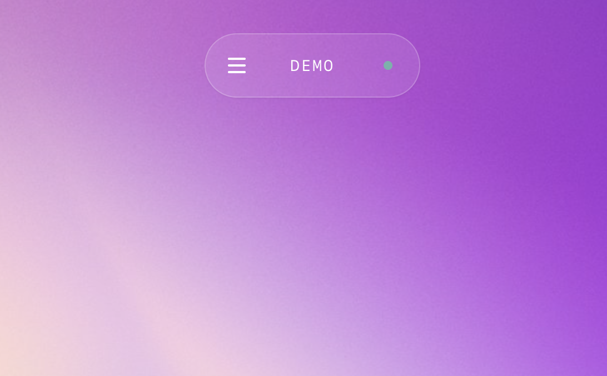

# GSAP MOTION SYSTEM

An industrial-grade testing facility for GSAP animation patterns. Features live demos, editable code, and a comprehensive pattern library with utilitarian design principles.



## ✨ Features

- 🎨 **8 Pattern Categories** - Entering, Exiting, Transform, Hover, Feedback, Continuous, 3D, Stagger
- 🎬 **Live Animation Demos** - Interactive playback with real-time preview
- ✏️ **Editable Code** - Modify and test animation parameters live
- 🔧 **Industrial Design** - Utilitarian interface with technical precision
- ⚡ **Performance Focused** - GPU-accelerated transforms only
- 📱 **Fully Responsive** - Optimized for desktop and mobile
- 🎯 **Easing Framework** - Learn when to use back.out vs back.inOut

## 🎬 Pattern Categories

### 1. Entering
Elements appearing on screen from nothing (opacity: 0, off-screen, scale: 0)
- **Key principle**: Use `back.out(1.7)` - skip invisible anticipation phase
- Variants: Fade Up, Fade Scale, Slide Right, Pop In

### 2. Exiting
Elements leaving or being dismissed
- **Key principle**: Use `power2.in` - accelerate out, don't linger
- Variants: Fade Out, Fly Away, Scale Out

### 3. Transform in Place
Visible elements changing state
- **Key principle**: Use `back.inOut(1.4)` - user sees full anticipation + settle
- Variants: Expand, Width Expand, Rotate, Morph Color

### 4. Hover Interactions
Micro-interactions for pointer events
- Variants: Subtle (Professional), Playful (Consumer), Lift with Shadow

### 5. User Feedback
Error states, success confirmations, attention grabs
- Variants: Error Shake, Attention Pulse, Success Bounce

### 6. Continuous Loops
Ambient, repeating motion
- **Key principle**: Use `sine.inOut` + `yoyo: true` for smooth loops
- Variants: Floating, Breathing Pulse, Slow Rotate

### 7. 3D Transforms
Perspective transforms and depth effects
- Variants: Card Flip, Fold Down, Tilt

### 8. Stagger
Sequential animations on groups
- **Key principle**: 60-120ms stagger timing feels balanced
- Variants: Cascade Down, Scale Stagger, Wave Effect

## 🚀 Quick Start

### Installation

```bash
# Clone the repository
git clone https://github.com/harisovcina/playground-motion-principles.git
cd playground-motion-principles

# Install dependencies
npm install

# Run development server
npm run dev
```

Open [http://localhost:3000](http://localhost:3000) in your browser.

### Build for Production

```bash
npm run build
npm start
```

## 📖 The Easing Framework

The core insight that drives the entire tutorial:

```
Is the element VISIBLE before animation starts?
│
├─ NO (entering) ────→ back.out(1.7)
│                      Skip invisible anticipation
│
├─ YES (transform) ──→ back.inOut(1.4)
│                      Show full wind-up + settle
│
└─ LEAVING (exit) ───→ power2.in / power3.in
                       Accelerate out, no settle
```

### Why This Matters

`back` easing includes:
- **Anticipation**: Pulls back before moving
- **Overshoot**: Goes past target, then settles

But if an element starts invisible, the anticipation phase is wasted—user sees nothing.

So:
- **Entering**: Skip anticipation with `back.out` - just the satisfying landing
- **Transforming**: Full `back.inOut` - user sees the whole journey
- **Exiting**: No settle needed with `power2.in` - it's gone anyway

## 🎛️ Duration Guidelines

| Element Type | Duration | Examples |
|--------------|----------|----------|
| Micro | 80-150ms | Hovers, toggles |
| Light | 150-250ms | Buttons, dropdowns |
| Medium | 250-400ms | Modals, panels |
| Heavy | 400-600ms | Page transitions |
| Dramatic | 600-1000ms | Onboarding, celebrations |

**Rule of thumb**: Larger distance = longer duration

## 🎨 Design System

### Color Palette
- **Industrial Yellow** (#ffcc00) - Primary accent, warnings, highlights
- **Safety Orange** - Transform operations
- **Warning Red** - Exit sequences and alerts
- **Steel Gray** - Secondary elements
- **Concrete Gray** - Backgrounds and borders

### Typography
- **Oswald** - Bold condensed display font
- **Roboto Mono** - Technical monospace for code

### Motion Effects
- Technical grid overlay
- Diagonal stripe patterns
- Industrial corner markers
- Hard-edge borders and minimal radius

## 🔧 Tech Stack

- [Next.js 15](https://nextjs.org/) - React framework
- [React 19](https://react.dev/) - UI library
- [TypeScript](https://www.typescriptlang.org/) - Type safety
- [GSAP 3.12+](https://greensock.com/gsap/) - Animation library
- [Tailwind CSS](https://tailwindcss.com/) - Utility-first CSS
- [Shadcn UI](https://ui.shadcn.com/) - Component library
- [Lucide React](https://lucide.dev/) - Icon library

## 📁 Project Structure

```
├── app/
│   ├── globals.css       # Global styles, CSS variables, animations
│   ├── layout.tsx        # Root layout with fonts
│   └── page.tsx          # Main tutorial page
├── components/
│   ├── GSAPTutorial.tsx  # Main tutorial component
│   └── ui/               # Shadcn UI components
├── lib/
│   └── utils.ts          # Utility functions (cn helper)
└── tailwind.config.ts    # Tailwind configuration
```

## 💡 Usage Examples

### Basic Animation

```typescript
// Fade up with back.out easing
gsap.from(".element", {
  y: 60,
  opacity: 0,
  ease: "back.out(1.7)",
  duration: 0.5
});
```

### Transform in Place

```typescript
// Expand with full anticipation
gsap.to(".element", {
  scale: 1.3,
  ease: "back.inOut(1.4)",
  duration: 0.5
});
```

### Stagger Animation

```typescript
// Cascade with optimal timing
gsap.from(".items", {
  y: 40,
  opacity: 0,
  ease: "back.out(1.7)",
  duration: 0.5,
  stagger: 0.08  // 80ms between each
});
```

## 🎓 Learning Resources

This project is based on production motion design principles:

- **Disney's 12 Principles** → Translated for UI
- **Easing Selection Framework** → Based on visibility state
- **Performance Rules** → GPU-accelerated properties only
- **Duration Guidelines** → Context-appropriate timing

## 🌐 Browser Support

- Chrome (latest)
- Firefox (latest)
- Safari (latest)
- Edge (latest)

> **Note**: Uses CSS backdrop-filter for glassmorphism effects. [Check compatibility](https://caniuse.com/css-backdrop-filter).

## 📄 License

MIT License - feel free to use this project for personal or commercial purposes.

## 🙏 Acknowledgments

- Motion principles from professional animation design
- Built with [Next.js](https://nextjs.org/)
- Animations powered by [GSAP](https://greensock.com/)
- Styled with [Tailwind CSS](https://tailwindcss.com/)
- UI components from [Shadcn UI](https://ui.shadcn.com/)

---

**Built with ❤️ by [Haris](https://github.com/harisovcina)**

**Developed with [Claude Code](https://claude.com/claude-code)**
